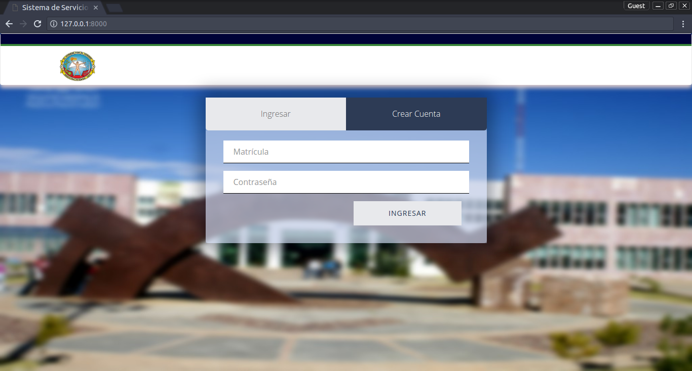

# Crear Cuenta/Iniciar Sesión

## Crear Cuenta

_Como se puede ver en la imagen anterior, hay que llenar cinco campos para poder ingresar al sistema como Pasante/Coordinador._

* **Matrícula:  **Se compone únicamente de un cadena de 8 números. Cada Pasante de medicina tiene una matricula la cual es brindada por la Universidad Autónoma de Zacatecas\(**Nota 01**\).
* **Contraseña: **La contraseña es definida por el usuario y puede tener: letras números y caracteres especiales\(!"\#$%&/\(\)=?¡\). Esta puede tener un tamaño máximo de 128 caracteres máximo\(**Nota 02**\).
* **Confirmar Contraseña: **Es un campo que permite comprobar que la contraseña se haya ingresado correctamente.
* **Correo Electrónico: **Campo para el correo electrónico ingresado al sistema, este correo posteriormente será utilizado para posibles cambios de contraseña, restablecimiento de cuenta o operaciones por parte del encardago del servicio social, por lo que es importante ingresar un correo válido y activo.
* **Correo Electrónico Alternativo: **Campo para el correo electrónico institucional o cualquier otro, este no es un campo obligatorio.
* **Captcha: ** Este campo permite realizar una prueba desafío-respuesta utilizada para determinar cuándo el Usuario es o no humano.

_Ejemplo de prueba Captcha, estas puede variar de acuerdo al servidor de Captchas._

### Formulario de "Crear Cuenta"

_Al dar clic en el botón "CREAR CUENTA" se indicará que el usuario se ha registrado de forma correcta y se enviará a la pestaña de "Inciar Sesión"._

#### Caso de Exito

_Cuando los datos insertados son correctos, es decir cumplen con los requerimeintos establecidos se redirigirá al Pasante a la siguiente ventana y se indicará con un mensaje que el usuario ha sido registrado._

#### Caso de Inserción de Datos Erroneos

##### Matrícula

  
_Si se ha creado una cuenta previamente con una matrícula ya registrada, se mostrará un mensaje indicando que la matrícula ha sido registrada previamente._

##### Contraseña

_Campo contraseña vacío._

_Si las contraseñas no coinciden, se mostrará un mensaje de contraseña no coincide._

##### Correo Electrónico

_Correo previamente registrado._

_Correo no cumple el formato_

_El campo correo debe cumplir con el formato "ejemplo@ejemplo.com" y no puede haber correos repetídos entre pasantes._

## Iniciar Sesión

_Como se puede ver en la imagen anterior, hay que llenar dos campos para poder ingresar al sistema como Pasante/Coordinador._

_Cuando los datos insertados son correctos, se abrirá la página principal del Sistema para el Pasante._

* **Matrícula: **Se compone únicamente de un cadena de 8 números. Cada Pasante de medicina tiene una matricula la cual es brindada por la Universidad Autónoma de Zacatecas \(**Nota 01**\).
* **Contraseña: **La contraseña es definida por el usuario y puede tener: letras números y caracteres especiales\(!"\#$%&/\(\)=?¡\). Esta puede tener un tamaño máximo de 128 caracteres máximo \(**Nota 02**\).

### Caso de Inserción de Datos Erroneos

_Cuando los datos insertados no coinciden con los almacenados, el Sistema simplemente indica que los datos son incorrectos sin mencionar si fue la matrícula o contraseña._

### Cerrar Sesión

Una vez realizado el registro del pasante\(ver capítulo siguiente\), este sólo podrá ver la página principal hasta que el Coordinador lo de de Alta en el Sistema.

Cuando el Pasante cierra sesión, se le redirigirá a la página de Iniciar Sesión/Crear Cuenta.

